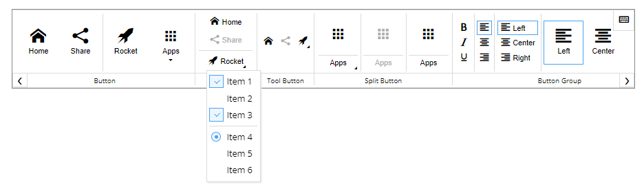

# Octo-Menu



Octo-Menu - Ribbon style menu for React.

The following components are available to you: 
- Push Button 
- Icon Button
- Tool Button (same as an icon button, but without caption) 
- Split Button 
- Dropdown Menu
- Dropdown Menu Groups
- Dividers (vertical and horizontal) for divide buttons (or any elements) inside a group
- Hotkey binder
- Service Panel
- Group
- Button Group

You can group elements into groups. Each group can have a title. If elements do not fit in the section, left and right menu scroll buttons appear.


You can create a button group where buttons will work as switchers. In the Dropdown Menu, elements also can work as switchers, including radio style.


Also, available is a service-panel, which is shown in the top right corner of the menu. You can put elements into this panel.

## Install
```shell
npm install @olton/octo-menu
```

## Using
```javascript
import React from "react"
import {
    Menu,
    Group,
    Divider,
    Button,
    Dropdown,
    DropdownMenu,
    DropdownMenuItem,
    DropdownMenuDivider,
    DropdownMenuGroup,
    IconButton,
    ToolButton,
    SplitButton,
    ButtonGroup,
    HorizontalDivider,
    VerticalDivider,
    ServicePanel 
} from "@olton/octo-menu"

const App = () => {
    return (
        <>
            <Menu>...</Menu>
        </>
    )
}
```

[Demo](https://codesandbox.io/s/octo-menu-lbtu3j) on CodeSandbox.